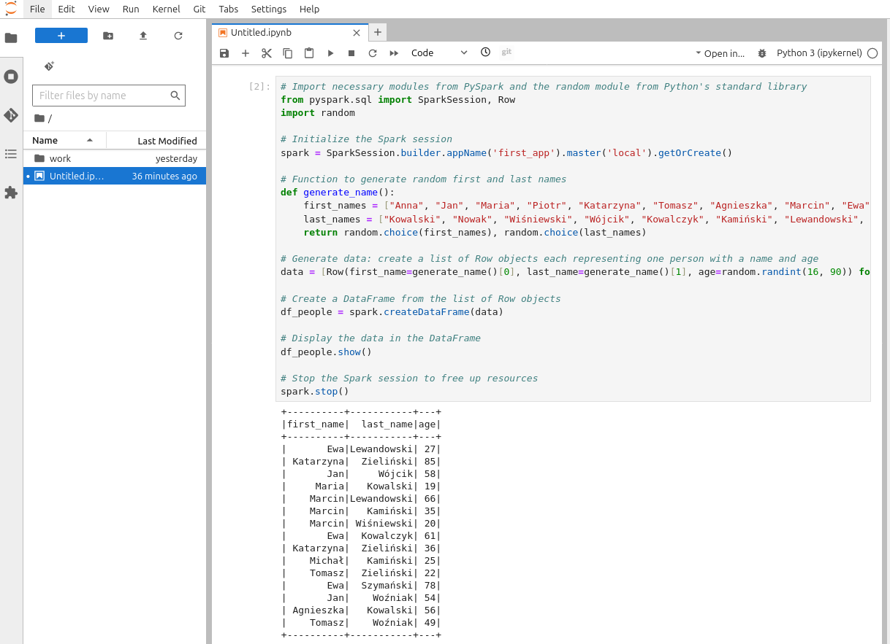

# This is my first PySpark program

## The Code

### Import Statements
- `from pyspark.sql import SparkSession, Row`: Imports the `SparkSession` and `Row` classes from the `pyspark.sql` module.
- `import random`: Imports the `random` module from Python's standard library, which is used for generating random numbers and selecting random items from a list.

### Spark Session Initialization
- `spark = SparkSession.builder.appName('first_app').master('local').getOrCreate()`: Initializes a Spark session with the application name 'first_app'. It sets the master to 'local', meaning it will run Spark locally on your machine. The `getOrCreate()` method will get an existing Spark session if one exists; otherwise, it will create a new one.

### Function Definition
- `def generate_name()`: Defines a function named `generate_name`.
  - `first_names = ["Anna", "Jan", "Maria", "Piotr", "Katarzyna", "Tomasz", "Agnieszka", "Marcin", "Ewa", "Michał"]`: A list of sample first names.
  - `last_names = ["Kowalski", "Nowak", "Wiśniewski", "Wójcik", "Kowalczyk", "Kamiński", "Lewandowski", "Zieliński", "Szymański", "Woźniak"]`: A list of sample last names.
  - `return random.choice(first_names), random.choice(last_names)`: Returns a tuple containing a randomly selected first name and a randomly selected last name using the `random.choice()` function.

### Data Generation
- `data = [Row(first_name=generate_name()[0], last_name=generate_name()[1], age=random.randint(16, 90)) for _ in range(15)]`: Generates a list of `Row` objects using a list comprehension. Each `Row` represents a person, containing a first name, a last name, and an age. The age is randomly generated between 16 and 90 using `random.randint()`.

### DataFrame Creation
- `df_people = spark.createDataFrame(data)`: Creates a DataFrame named `df_people` from the list of `Row` objects. This DataFrame is structured with columns corresponding to the attributes in each `Row` (first name, last name, age).

### Display Data
- `df_people.show()`: Displays the contents of the DataFrame `df_people` in a tabular format. This method prints out the DataFrame to the console, showing a quick overview of the data.
### Display only first name and last name in DataFrame
- `df_people.select("first_name", "last_name").show()`: Displays displays only selected columns.

### Terminate Spark Session
- `spark.stop()`: Stops the Spark session to free up resources. This is important for cleaning up and ensuring that there are no lingering processes that could consume system resources.

## How to launch PySpark?

Because I use Linux and have frequently been changing its distribution lately, I chose Docker. 
This allows me to quickly set up the environment from scratch, without undergoing the long and tedious installation of Java directly on my computer.

I have used an official Spark container (https://hub.docker.com/_/spark) (of course, you must have Docker installed on your computer first):

```bash
docker run -it -v "${PWD}":/opt/spark/work-dir spark:python3 bash
```

The command `docker run -it -v "${PWD}":/opt/spark/work-dir spark:python3 bash` is used to start a Docker container with specific (Spark) options:

  - `docker run`: This is the primary command used to run a Docker container.
  - `-it`: This option combines two flags, -i and -t. The -i flag keeps STDIN open even if not attached, and the -t flag allocates a pseudo-terminal. Together, these make the container start in interactive mode with a terminal, allowing you to interact with the shell inside the container.
  - `-v "${PWD}":/opt/spark/work-dir`: This option mounts a volume. It maps the current working directory (denoted by ${PWD}) on the host machine to /opt/spark/work-dir inside the container. This allows for sharing files between the host and the container.
  - `spark:python3`: Specifies the Docker image to use. In this case, it refers to an image named `spark` tagged with `python3`, which is a custom image pre-configured with a Spark environment suitable for Python 3 applications.
  - `bash`: This is the command that gets executed inside the container once it starts. In this case, it starts a Bash shell, allowing you to interact with the shell environment directly.

This command is particularly useful for setting up a consistent development environment for Spark applications using Python 3, especially when working across different machines or ensuring that all dependencies are contained and managed within Docker.

## Result

After entering shell and running:
```bash
/opt/spark/bin/spark-submit first_app.py
```
I got the result:
```
+----------+-----------+---+
|first_name|  last_name|age|
+----------+-----------+---+
|     Maria| Wiśniewski| 74|
|     Maria|  Zieliński| 39|
|    Marcin|    Woźniak| 87|
|      Anna|   Kowalski| 57|
|    Marcin|  Szymański| 62|
|      Anna|  Zieliński| 50|
|     Maria|    Woźniak| 58|
|    Tomasz|   Kowalski| 55|
|    Tomasz|  Szymański| 42|
|    Marcin| Wiśniewski| 77|
|     Maria|  Kowalczyk| 19|
|    Michał|  Kowalczyk| 79|
|       Jan|Lewandowski| 36|
|       Jan|   Kamiński| 25|
|    Michał|     Wójcik| 28|
+----------+-----------+---+
```
# Tip

An even better thing that I discovered during this project is the use of Jupyter Notebook, which allows for quick prototyping and viewing the results in a convenient way.

Jupyter Notebook is an open-source web application that allows you to create and share documents that contain live code, equations, visualizations, and narrative text. It supports over 40 programming languages, including Python, R, Julia, and Scala. Jupyter Notebooks are particularly popular among data scientists and researchers for interactive data analysis, scientific computing, and machine learning projects. The tool enables users to seamlessly integrate code and its output into a single document (called "Notebook"), along with text, mathematical expressions, and other rich media.

Just try:
```bash
docker run --detach -p 8888:8888 -p 4040:4040 -p 4041:4041 quay.io/jupyter/pyspark-notebook
```

The image repository: https://hub.docker.com/r/jupyter/pyspark-notebook

After starting the container, check its log and look for "token" line, for example:
```bash
docker logs cf396d118b16 2>&1 | grep token

[I 2024-04-29 15:36:24.180 ServerApp] http://cf396d118b16:8888/lab?token=6d882021381219519f695b78a434ca7287bab1...
[I 2024-04-29 15:36:24.180 ServerApp]     http://127.0.0.1:8888/lab?token=6d882021381219519f695b78a434ca7287bab1...
```

Use the 127.0.0.1 URL and enjoy your notebook :) 
